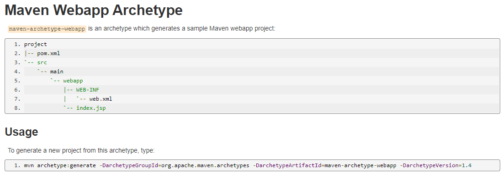

## 前置知识
- Java基础
- JavaWeb(Servlet、Jsp等)


## 1 为什么要学习Maven？

### 1.1 Maven可以作为`依赖管理工具`

1. **应对所需jar包规模越来越大的问题**：当我们使用封装程度很高的框架时，项目的一个模块中用到的jar包是非常多的。可能只用到框架中的三个不同功能，就需要导入100多个jar包。使用maven可以很大程度的简化导入jar包依赖的过程。

2. **无需关心jar包的来源**：使用maven可以实现对依赖的jar包自动下载。

3. **自动解决jar包之间的依赖关系**：使用maven可以自动的解析jar包之间的依赖关系。

### 1.2 Maven作为`构建管理工具`

- 构建过程：
    

### 1.3 结论

- `管理规模庞大的 jar 包`，需要专门工具。
- `脱离 IDE 环境执行构建操作`，需要专门工具。

## 2 Maven是什么？

Maven是Apache软件基金会组织维护的一个专门为Java项目提供`构建`和`依赖`管理支持的工具。

### 2.1 构建

构建指的是：使用`原材料`生产`产品`的过程。Java项目中，原材料指的是：`Java源代码、图片、配置文件等等`。产品指的是：`可以在服务器运行的项目`。

构建过程包含的主要环节有：
- **清理**：删除上一次构建的结果，为下一次构建做好准备。
- **编译**：将Java源程序编译成`.class`字节码文件。
- **测试**：运行提前准备好的测试程序。Maven默认使用`junit`进行测试。
- **报告**：针对测试结果生成一个全面的信息。
- **打包**：
    - Java工程：`jar包`
    - Web工程：`war包`
- **安装**：把一个Maven工程经过打包操作生成的jar包或war包存入到Maven仓库。
- **部署**：将准备好的jar包或war包部署到服务器运行。
    - `部署jar包`：把一个jar包部署到Nexus私服服务器上。
    - `部署war包`：借助相关Maven插件（例如 cargo ），将 war 包部署到 Tomcat 服务器上。

### 2.2 依赖

依赖管理解决了以下的问题：
- jar包的下载：使用Maven后，jar包会从规范的远程仓库下载到本地。
- jar包之间的依赖：通过依赖的传递性自动解决。
- jar包之间的冲突，通过对依赖的配置进行调整，使得产生冲突的jar包不会被导入。
 

### 2.3 Maven工作机制


- [Maven官网](https://maven.apache.org/index.html)
- [下载页面](https://maven.apache.org/download.cgi)


## 3 配置Maven核心程序
在解压目录中，`conf/setting.xml`是Maven的核心配置文件。

### 3.1 配置本地仓库地址

- 默认目录：
    ```xml
    <!-- localRepository
    | The path to the local repository maven will use to store artifacts.
    |
    | Default: ${user.home}/.m2/repository
    <localRepository>/path/to/local/repo</localRepository>
    -->
    ```
修改只需要将`<localRepository>`标签配置好即可。

### 3.2 配置阿里云镜像地址

Maven下载jar包是访问境外的中央仓库，所以下载速度会很慢，要提高下载速度，就需要配置镜像地址。
1. 注释掉默认的配置：
    ```xml
    <mirror>
      <id>maven-default-http-blocker</id>
      <mirrorOf>external:http:*</mirrorOf>
      <name>Pseudo repository to mirror external repositories initially using HTTP.</name>
      <url>http://0.0.0.0/</url>
      <blocked>true</blocked>
    </mirror>
    ```

- 修改为自己的配置：
    ```xml
    <mirror>
        <id>aliyunmaven</id>
        <mirrorOf>*</mirrorOf>
        <name>阿里云公共仓库</name>
        <url>https://maven.aliyun.com/repository/public</url>
    </mirror>
    ```

### 3.3 配置Maven工程的基础JDK版本

默认配置是使用1.5版本的JDK，而通常都使用的是JDK1.8。所以将以下配置复制到`profiles`标签内。
```xml
<profile>
    <id>jdk-1.8</id>
    <activation>
        <activeByDefault>true</activeByDefault>
        <jdk>1.8</jdk>
    </activation>
    <properties>
        <maven.compiler.source>1.8</maven.compiler.source>
        <maven.compiler.target>1.8</maven.compiler.target>
        <maven.compiler.compilerVersion>1.8</maven.compiler.compilerVersion>
    </properties>
</profile>
```

## 4 根据坐标创建Maven工程

### 4.1 Maven核心概念：`坐标`

类似于三维空间定位一个点需要使用三个坐标点，Maven也使用三个坐标**唯一定位**`Maven仓库`中的一个`jar`包。这三个坐标分别是：
- `groupId`：公司或组织的 id，取值为公司或组织域名的倒序，通常还会加上项目名称。
    - 如：`org.apache.maven`

- `artifactID`：一个项目或者是项目中的一个模块的 id，取值为模块的名称，后面会作为Maven工程的工程名。

- `Version`：模块的版本号
    - `SNAPSHOT`：表示快照版本，正在迭代过程中，不稳定的版本。
    - `RELEASE`：表示正式版本


### 4.2 坐标和Maven本地仓库中jar包存储路径之间的对应关系举例

- 坐标：
    ```xml
    <groupId>javax.servlet</groupId>
    <artifactId>servlet-api</artifactId>
    <version>2.5</version>
    ```
- 在本地仓库中所对应存储路径：
    ```text
    Maven本地仓库目录/javax/servlet/servlet-api/2.5/servlet-api-2.5.jar
    ```

### 4.3 实验操作

1. 创建工程
    
    ```shell
    $ mvn archetype:generate

    ....
    Downloaded from central: https://repo.maven.apache.org/maven2/org/apache/maven/archetypes/maven-archetype-quickstart/1.0/maven-archetype-quickstart-1.0.jar (4.3 kB at 26 kB/s)
    Define value for property 'groupId': com.mwt.maven
    Define value for property 'artifactId': maven-java
    Define value for property 'version' 1.0-SNAPSHOT: :
    Define value for property 'package' com.mwt.maven: :
    Confirm properties configuration:
    groupId: com.mwt.maven      # 输入groupId
    artifactId: maven-java      # 输入artifactId   
    version: 1.0-SNAPSHOT       # 输入版本信息
    package: com.mwt.maven
    Y: : y     # y表示同意创建
    [INFO] ----------------------------------------------------------------------------
    [INFO] Using following parameters for creating project from Old (1.x) Archetype: maven-archetype-quickstart:1.0
    [INFO] ----------------------------------------------------------------------------
    [INFO] Parameter: basedir, Value: /Users/muwentao/Desktop/CodeField/MavenSpace/SpaceVedio
    [INFO] Parameter: package, Value: com.mwt.maven
    [INFO] Parameter: groupId, Value: com.mwt.maven
    [INFO] Parameter: artifactId, Value: maven-java
    [INFO] Parameter: packageName, Value: com.mwt.maven
    [INFO] Parameter: version, Value: 1.0-SNAPSHOT
    [INFO] project created from Old (1.x) Archetype in dir: /Users/muwentao/Desktop/CodeField/MavenSpace/SpaceVedio/maven-java
    [INFO] ------------------------------------------------------------------------
    [INFO] BUILD SUCCESS
    [INFO] ------------------------------------------------------------------------
    [INFO] Total time:  04:40 min
    [INFO] Finished at: 2023-04-12T16:09:43+08:00
    [INFO] ------------------------------------------------------------------------
    ```

2. 调整
    Maven默认生成的工程，对junit依赖的是较低的3.8.1版本，可以改为更合适的4.12的版本。

    另外自动生成的App.java和AppTest.java不需要也可以删除掉。
    **解读`pom.xml`文件**：
    ```xml
    <!-- 根标签：project，表示对当前工程进行配置、管理 -->
    <project xmlns="http://maven.apache.org/POM/4.0.0" xmlns:xsi="http://www.w3.org/2001/XMLSchema-instance"
    xsi:schemaLocation="http://maven.apache.org/POM/4.0.0 http://maven.apache.org/maven-v4_0_0.xsd">
    
    <!-- 从Maven2开始就固定为4.0.0，代表当前pom.xml所采用的标签结构 -->
    <modelVersion>4.0.0</modelVersion>

    <!-- 坐标信息：gav -->
    <groupId>com.mwt.maven</groupId>
    <artifactId>maven-java</artifactId>
    <version>1.0-SNAPSHOT</version>

    <!-- 打包方式，默认为jar包（表示Java工程），还可以取值为war（表示web工程）、pom（表示用来管理其他工程的工程）-->
    <packaging>jar</packaging>
    
    <name>maven-java</name>
    <url>http://maven.apache.org</url>

    <!-- 依赖信息配置，可以包含多个dependency标签 -->
    <dependencies>

        <!-- 创建一个具体的依赖 -->
        <dependency>

        <!-- 通过坐标依赖其他jar包 -->
        <groupId>junit</groupId>
        <artifactId>junit</artifactId>
        <version>4.12</version>

        <!-- 表示依赖生效范围 -->
        <scope>test</scope>
        
        </dependency>
    </dependencies>
    </project>
    ```

### 4.4 Maven核心概念：POM

- 含义：Project Object Model，项目对象模型。类似的DOM（Document Object Model，文档对象模型）都是模型化思想的具体体现。

- 具体思想：将工程抽象为一个模型，再用程序中的对象描述这个模型，实现通过程序管理项目工程。

- 对应的核心配置文件：`pom.xml`


### 4.5 Maven约定的目录结构

- 各个目录结构的含义作用
    
    另外专门用于存放构建输出结果的目录是`target`。

- 约定目录结构的意义

    为了使构建过程尽可能自动化完成。

- 开发领域的技术发展趋势：`配置大于编码，约定大于配置`。

### 4.6 在Maven工程中写代码
- 主体程序（被测试的程序）写在主体程序目录中存放Java源代码的目录结构中
    ```java
    package com.mwt.maven;

    public class Calculator {

        public int sum(int i, int j){
            return i + j;
        }
    }
    ```

- 测试程序存放位置同理
    ```java
    package com.mwt.maven;

    import org.junit.Test;

    // 静态导入的效果是将Assert类中的静态资源导入当前类
    // 这样一来，在当前类中就可以直接使用Assert类中的静态资源，不需要写类名
    import static org.junit.Assert.*;

    public class CalculatorTest {

        @Test
        public void testSum(){

            // 1.创建Calculator对象
            Calculator calculator = new Calculator();

            // 2.调用Calculator对象的方法，获取到程序运行实际的结果
            int actualResult = calculator.sum(5, 3);

            // 3.声明一个变量，表示程序运行期待的结果
            int expectedResult = 8;

            // 4.使用断言来判断实际结果和期待结果是否一致
            // 如果一致：测试通过，不会抛出异常
            // 如果不一致：抛出异常，测试失败
            assertEquals(expectedResult, actualResult);

            // 为了证明测试过程执行了本程序，添加一行输出代码
            System.out.println("Test method have been called !");

        }
    }
    ```

### 4.7 执行Maven的构建命令

- 要求：运行Maven中和构建操作相关的命令时，必须进入到`pom.xml`所在的目录中。

- **清理**：`mvn clean`。效果：删除`target`目录。

- **编译**：
    - 对主程序编译：`mvn compile`。编译结果存放在：`target/classes`。
    - 对测试程序编译：`mvn test-compile`。编译结果存放在：`target/test-classes`。

- **测试**：`mvn test`。测试的报告结果存放在`target/surefire-reports`中。

- **打包**：`mvn package`。结果存放在`target`目录中，测试程序不会包含在里面。名称是由`archefactId`与`Version`构成的。

- **安装**：`mvn install`。效果：将本地构建过程生成的jar包存入Maven本地仓库中。存放路径是依据坐标生成的，另外安装操作还会将`pom.xml`文件一起存入本地仓库中。 


### 4.8 创建一个Web工程

参数 `archetypeGroupId`、`archetypeArtifactId`、`archetypeVersion` 用来指定现在使用的 maven-archetype-webapp 的坐标。

- 在工作空间中创建一个新的工程
    ```shell
    mvn archetype:generate -DarchetypeGroupId=org.apache.maven.archetypes -DarchetypeArtifactId=maven-archetype-webapp -DarchetypeVersion=1.4
    ```
    这时`pom.xml`中的打包方式就是`war`了。

- 创建Servlet
    ```java
    package com.mwt.maven;

    import javax.servlet.http.HttpServlet;
    import javax.servlet.http.HttpServletRequest;
    import javax.servlet.http.HttpServletResponse;
    import javax.servlet.ServletException;
    import java.io.IOException;

    public class HelloServlet extends HttpServlet{

        protected void doGet(HttpServletRequest request, HttpServletResponse response) throws ServletException, IOException {

            response.getWriter().write("hello maven web");

        }

    }
    ```

- 配置Servlet
    ```xml
    <servlet>
        <servlet-name>helloServlet</servlet-name>
        <servlet-class>com.mwt.maven.HelloServlet</servlet-class>
    </servlet>
    <servlet-mapping>
        <servlet-name>helloServlet</servlet-name>
        <url-pattern>/helloServlet</url-pattern>
    </servlet-mapping>
    ```

- 在`index.jsp`中添加超链接
    ```jsp
    <html>
    <body>
        <h2>Hello World!</h2>
        <a href="helloServlet">Access Servlet</a>
    </body>
    </html>
    ```

- 手动导入项目所需依赖`servlet-api`：在[Maven Repository](https://mvnrepository.com/)中找所需依赖，复制粘贴到`pom.xml`中。
    ```xml
    <!-- https://mvnrepository.com/artifact/javax.servlet/javax.servlet-api -->
    <dependency>
      <groupId>javax.servlet</groupId>
      <artifactId>javax.servlet-api</artifactId>
      <version>3.1.0</version>
      <scope>provided</scope>
    </dependency>
    ```

- 之后执行编译、打包部署等过程即可。