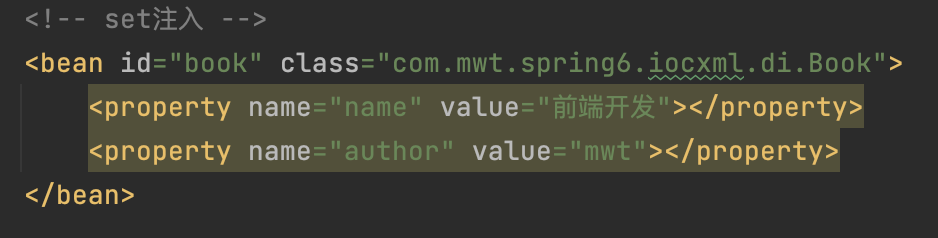
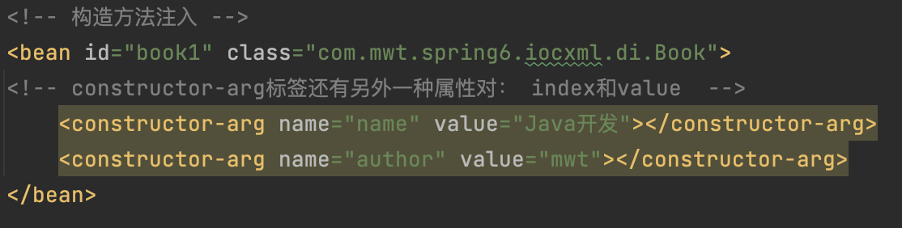

## 前置知识

- [Maven 基础](./docs/Maven基础篇.md)
- Java 基础

## 1 概述

### 1.1 Spring是什么？

Spring是一个主流的JavaEE`轻量级`、`开源`框架，其目的是用于`简化Java企业级应用的开发难度和开发周期`。Spring框架除了自己提供功能外，还提供整合其他技术和框架的能力。

[Spring官网](https://spring.io/)

### 1.2 Spring划分方式

- **广义上的Spring**：泛指以`Spring Framework`为核心的Spring技术栈。

- **狭义上的Spring**：特指`Spring Framework框架`。其内部有两个核心模块：`IOC`和`AOP`。
    - **IOC**：Inverse of Control，控制反转，指的是把创建对象的过程交给 Spring 进行管理。
    - **AOP**：Aspect Oriented Programming，面向切面编程。 AOP通过封装多个类的公共行为（与业务无关，业务模块所共同调用的逻辑功能），提高代码重用性，降低耦合度。通过AOP可以在很少改变源代码的情况下，增加一个功能，比如增加日志、事务、权限等功能。

### 1.3 Spring Framework的特点

- **非侵入式**：使用Spring Framework开发应用程序时，对应用程序本身的结构影响非常小，几乎可以做到”`零污染`“，只需对功能性组建使用几个简单的注解进行标记即可。
- **控制反转**：反转资源获取方向，把自己创建资源，向环境索取资源变成环境将资源（对象）准备好，直接享受资源注入即可。
- **面向切面编程**：在不修改源代码的基础上增强代码功能。
- **容器**：Spring IOC是一个容器，包含并且管理组件对象的生命周期。实现对对象资源的容器化管理。
- **组件化**：Spring实现了使用简单的组件配置组合成一个复杂的应用，只需要使用XML或Java注解组合这些组件对象即可。
- **一站式**：Spring旗下的项目覆盖领域非常广泛，很多功能需求都可以在Spring Framework的基础上配合Spring其他模块实现。

### 1.4 Spring 模块组成

1. **Core Container**：Spring Core提供了IOC、DI、Bean配置装载创建的核心实现。核心概念：Beans、BeanFactory、BeanDefinitions、ApplicationContext。
    - Spring-core：IOC和DI的基本实现
    - Spring-beans: BeanFactory和Bean的装配管理。
    - Spring-context：Spring context上下文，即IOC容器（AppliactionContext）
    - Spring-expression：Spring表达式语言

2. **Spring AOP**：
    - Spring-aop：面向切面编程的应用模块，整合ASM、CGLib、
    - Spring-aspects

3. **Spring Data Access**：

4. **Spring Web**：

5. **Spring Message**：
    - Spring-messaging：spring4.0提供的，为Spring集成一些基础的报文传送服务。

6. **Spring test**：
    - Spring-test：集成测试支持，主要是对junit的封装。

## 2 容器 IoC

`IoC`：Inversion of Control，控制反转，它并不是一门技术，而是一种`设计思想`，是一个重要的面向对象编程法则，能够指导我们设计出松耦合、更优良的程序。

Spring 通过`IoC容器`来**管理所有 Java 对象的实例化和初始化**，**控制对象与对象之间的依赖关系**。我们将由IoC容器管理的对象成为称为`Spring Bean`，它与使用关键字`new`创建的 Java 对象没有任何区别。

### 2.1 IoC容器

#### 2.1.1 控制反转

- 控制反转是一种`思想`。
- 控制反转是为了`降低程序耦合度`，`提高程序扩展力`。
- 控制反转，反转的是什么？
    - 将对象的`创建权`交给第三方容器负责
    - 将对象和对象之间关系的`维护权`交给第三方容器负责。
- 如何实现这种思想？
    - `DI（Dependency Injection）`：依赖注入

#### 2.1.2 依赖注入

指的是**在 Spring 创建对象的过程中，将对象所依赖的属性通过配置进行注入**。常见的依赖注入实现方式有两种：

- `Set注入`：通过`<bean>`标签中的`<property>`标签完成。
    
- `构造注入`：通过`<bean>`标签中的`<constructor-arg>`标签完成。
    

Bean管理指的就是：**Bean对象的创建**以及**Bean对象中属性的赋值（或者叫做Bean对象之间关系的维护）**。

#### 2.1.3 IoC在Spring中的实现

Spring 的 IoC 容器就是 IoC 思想的一个落地的产品实现。IoC容器中管理的组件也叫做 bean。再创建 bean 之前，首先需要创建 IoC 容器。Spring 提供了 IoC 容器的两种实现方式：

- `BeanFactory`：这是 IoC 容器的基本实现，是 Spring 内部使用的接口。面向 Spring 本身，不提供给开发人员使用。

- `ApplicationContext`：BeanFactory 的子接口，提供了更多高级特性。面向 Spring 的使用者，几乎所有场合都使用 ApplicationContext，而不是底层的 BeanFactory。

- `ApplicationContext`的主要实现类：
    | 类型名 | 简介 |
    | --- | --- |
    | ClassPathXmlApplicationContext | 通过读取类路径下的XML格式的配置文件创建IOC容器对象 | 
    | FileSystemXmlApplicationContext | 通过文件系统路径读取XML格式的配置文件创建IOC容器对象 |
    | ConfigurableApplicationContext | ApplicationContext的子接口，包含一些扩展方法refresh()和close()，让ApplicationContext具有启动、关闭和刷新上下文的能力|
    | WebApplicationContext | 专门为Web应用准备，基于Web环境创建IOC容器对象，并将对象引入ServletContext域中|

#### 2.1.4 特殊值处理
